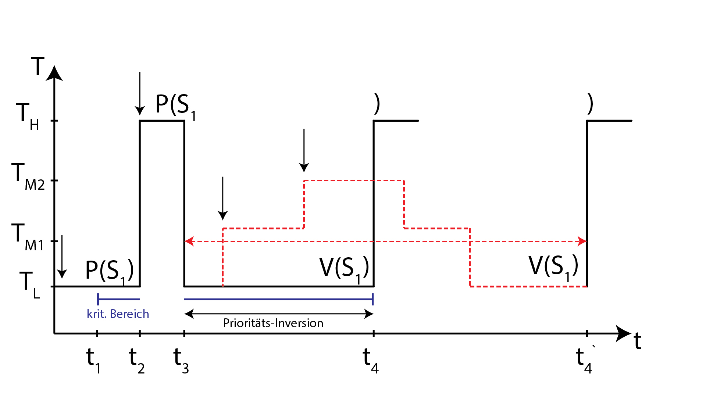

# real-time-systems

This is just a self-educational project that contains the implementation of the practical tasks from the course "Real-time systems" in the University of Applied Science Merseburg and is published here to trace the code changes and host the source code. 

This project is not the reference or tutorial, may contain errors and is not and doesn't target the "best-practices" implementation. It also contains some short informational snippets from Wikipedia to make a quick recap of the entities or mechanisms being used or implemented.

## 1.1 TO DO: Describe the first task

## 1.2 Inter-task communication

Task - in the context of the "Real-time Systems" under microC OS II is a process.

### Target

The task is to program a system with the following functions:
* **"keyboard" task**, that reads 5 times pro seconds an input from the keyboard. If the `ESC` key has been pressed, the program must stop its execution. Pressing the keys `1-4` starts the corresponding numerated task. 
* **4 working tasks (workers)**, each of them has a `call-counter` and a `timeout-counter`. All counters are initialized with 0 at the beginning.

| Task 1 | Task 2 | Task 3 | Task 4 |
|--------|--------|--------|--------|
| CC:0 | CC:0 | CC:0 | CC:0 |
| TC:0 | TC:0 | TC:0 | TC:0 |

Each of the 4 workers increment their own call-counter after getting called from the keyboard task, and  the timeout-counter if they are not getting called longer than 4 seconds.

The inter-task communication must be implemented using: 
* global variable
* semaphore
* message (mailbox)

### Theory

Interprocess communication (IPC) refers specifically to the mechanisms an operating system provides to allow the processes to manage shared data. Depending on solution IPC mechanism may provide synchronization or leave it up to processes and threads communicating (such as shared memory).

### Semaphore
A **semaphore** is a variable or abstract data type used to control access to a common resource by multiple processes in a concurrent system . A trivial semaphore is a plain variable that is changed depending on programmer-defined conditions. The variable is then used as a condition to control access to some system resource. 

Semaphores are a useful tool in the prevention of [race conditions](https://en.wikipedia.org/wiki/Race_condition). Semaphores which allow an arbitrary resource count are called **counting semaphores**, while semaphores which are restricted to the values 0 and 1 (or locked/unlocked, unavailable/available) are called **binary semaphores** and are used to implement locks.A mutex is essentially the same thing as a binary semaphore and sometimes uses the same basic implementation. The differences between them are in how they are used. While a binary semaphore may be used as a mutex, a mutex is a more specific use-case, in that only the thread that locked the mutex is supposed to unlock it. Click [here](https://en.wikipedia.org/wiki/Semaphore_(programming)) to read more about semaphores.

#### `Comm() = OSSemCreate(x)`
This function returns the pointer for a created semaphore.
`Comm()` is a pointer of the OS_EVENT type.
If we got NULL, then we should log an error, as the semaphore could not be created.

1. Wait for an event x = 0.
2. Lock critical code x = 1.
3. Counting semaphore x > 1

* If the internal value of the x = 0, the semaphore is not available and the process should wait. We should wait for an event.
* If the internal value of the x = 1, the semaphore will be decremented and the process continues execution.
* If x > 1, then the x will be decremented and the process continues its execution. This would be a counter semaphore.

#### `OSSemPend(semaphore, timeout, &err)`
* If timeout = 0, then we wait, until the semaphore is available.
* If timeout > 0, then we wait a number of ticks. 
When number of ticks is 0, then we enter the critical code and should check &err, if the semaphore is available (has been posted).

#### `OSSemPost`
`status = OSSemPost(semaphore);`
* OS_NO_ERR
* Overflow happens when we post semaphore, that has been already posted.

#### `OSSemQuery and OSSemAccept`
It is possible to obtain a semaphore without putting a task to sleep if the semaphore is not
available.The code that called OSSemAccept() needs to examine the returned value. A returned value of zero indicates that the semaphore is not available; a nonzero value indicates that the semaphore is available. Furthermore, a nonzero value indicates to the caller the number of resources that are available.

### `Mbox and Queue`
* Create
* Post
* Pend
* Query
* Accept

## 1.3 Performance test

### Target
Create 2, 10, 20, 40 Tasks, where each next task waits for its semaphore being posted from the previous task, release a semaphore for the next one and pends its semaphore again. 
The initial tasks displays the number of round trips per second.
A round trip increments every time when the list of created tasks has been iterated through.

### Theory 

The task with the **lowest priority** is the idle task that counts the statistics. It usually comes in when the other tasks are blocked or the processor is "idle".

**P: SemPend** -> pushes the task to the list of blocked.
**V: SemPost** -> goes to the list of the blocked tasks and looks up for the blocked task through this semaphore, frees the semaphore.

## 1.4 Shared memory 

### Target

Create 10 similar tasks that have access to a shared memory, namely global integer variable. Each task should run a loop of 10000 iterations and increment the global variable respectively. After all the tasks have finished their iterations and stopped incrementing the global variable, the initial task should show the resulting gloval variable value.

### Theory

The tasks under the UNIX are the separate processes. Each process has its own memory and therefore accessing and incrementing the global variable, a.k.a shared memory, would not work as expected as each process has its own copy of this variable. 

The workaround would be to pass the pointer on the shared memory as a parameter to the fork() function. This will result into sharing the memory between processes, in other words, each of the processes, a.k.a. tasks, would increment the same variable. 

The problem is that this will happen randomly and according some scheduling UNIX logic. The value of the global variable would result every time into random number and would not work as expected due to the run conditions.

The usage of the semaphore, that is shared over the all processes, helps solving this problem.

However, under the MicroC/OS II this works another way. The tasks here are the threads within a process that share the same global variables. Moreover, we don't need to use any semaphores or other mechanisms for avoiding the race conditions as these are not necessary here. The reason for that is that each task has a priority and the execution of the task with a lower priority will be available only as soon as the task with a higher priority gives it a chance, in other words - CPU time. 

```c
for(i = 0; i < ROUND_TRIPS; i++){
    number = *shmptr;
    number++;
    *shmptr = number; 
}
while(1){
    wait(1);
}
```

One thing to mention, is that under the MicroC OS each task should run in a loop, as the exiting will cause the scheduling resume/suspend errors. Say, we are in the task with a priority 5, where we start incrementing the shared variable. The other tasks would not become a CPU time, until this task enters its "idle" loop and makes a time delay. When this happens, we enter the task with a priority 6, that respectively increments the shared variable (which value is already ROUND_TRIPS from the previous task).
This continues until all the tasks enter their "idle" while loop. 
This is why we don't need any mechanisms here to access and modify shared memory.

In the implementation example, we have simulated the task scheduling through the wait inside the for-loop iteration. 

## 1.5. Priority Inversion

### Target
    The task with a lower-priority 
### Theory

**Priority inversion** - is the mechanism, when the task with a lower priority is executed while the one with the higher is blocked.
In other words, the critical section of the task with a higher priority can be entered through the semaphore (pending), that can be released(posted) in the task with a lower priority. 
The task with a higher priority whose semaphore has been released comes to the execution through the interrupt of the lower-priority task.  



The `T_l` task has blocked the `T_m1` and `T_m2`, that are not ready to be executed. When we call `T_l` `V(S1)`, which means we release the semaphore for the task `T_h`, then there are two opportunities:
* (not performant) just push the blocked task `T_h` to the list of **READY** tasks and make prioritising.
* (performant, used in micos) just compare the priority of the task `T_l` and `T_h` and if the prio of `T_h` higher as the one of the `T_l`, just execute the `T_h task`. 

The properties of the priority inversion are:
* priorities
* semaphores

The ways to solve the priority inversion problem could be:
* semaphores forbidden
* with semaphores, but do one of the following
    * forbid the interupts to critical section to make that code be executed as soon as possible;
    * allow the interrupt, but forbid the scheduler;
    * use priority inheritance protocol;
        * Inheritance mechanism:
            > For example, we have two tasks with **priority inversion**. The lower-prio task (prio 6) pends the semaphore of the higher-prio task (prio 4). So, the higher-prio task is blocked. 
            
            > Assume, we create another task, that has a middle-prio (5), and comes to the execution. Because this middle-prio task has higher priority than the lower-prio, it may come to the case when the lower-prio task will not get computation time and the higher-prio task will have to wait longer (or forever). 
            
            > To avoid this, the inheritance mechanism comes into play. The lower-prio task gets the prio of the higher-prio task so that no middle-priority task blocks the lower and the higher one. We must use **mutexes** (thas support priority inheritance protocol) instead of **semaphores** here.^
            > **NOTE!** We should make sure, that the first free highest priority is not used, because it will be used by the lower priority task (that blocks the higher-prio task). This is due to the fact, that each task can have only one priority. 
    * use priority ceiling protocol;
    * use mutexes.

## Producer/Consumer problem
**TODO**

## Periodic Task Scheduling
> Periodic - cyclic events, non-periodic - random events, e.g. user interrupts.

## `Timeline scheduling` (Everything should be planned by the developer)
The actions are strictly planned before using in production, as we've got all the tasks statically defined. Should implement requirements. Need only simple processor with time interrupter. Design is the most important part here.

|Tasks| Frequency |Tasks time in ms. (period)|
|-----|-----------|-----------------|
|A|40|25|
|B|20|50|
|C|10|100|


### Time slice.
* `Greatest common divisor (T)` - Minor cycle. (25)

* `Least common multiple (T)` - Major cycle. (200)

We don't need interrupt here. This is needed only in a dynamically executed program.
We don't have interrupts in Timeline scheduling, because we have already all the things designed and implemented.
**We have only a timer interrupt to start the minor cycle.**

### Necessary requirements:
* computation time of a `C(A) + C(B) <= Minor Cycle`
* `C(A) + C(C) <= Minor Cycle`

`C(A)` - is calculated from the `profiler` file by the machine.

Timer - Interrupt:
`n` - number of the minor cycles (e.g. 0, 1, 2, 3).

#### Timer interrupt function or **Scheduler**.
```c
int n = 0 // out of the interrupt routine

//.....
// n is the counter where should we jump
n = n % (Count of the minor cycles that fit into the major cycle). // e.g. 4

switch(n){
    case 0:
        A();
        B();
        break;
    case 1: 
        A();
        C();
        break;
    case 2:
        A();
        B();
        break;
    case 3: 
        A();
        break;
}

n++;
```

Overhead: 50 process cycles to execute the code.
(In Unix - more than 1000 process cycles to switch the task).

### Pros 
1. Simple to implement, no OS is requireded.
2. No overhead.
3. No Producer-Consumer Problem.
4. No need for semaphores or mutexes (we usually need them to control critical regions, we can use simple integer variable here).
5. Equidistant calls.
6. No Jitter.

### Cons
1. Very unflexible and breaks the whole system when we change any of the call periods (T).

|Tasks| Frequency |Tasks time in ms. (period)|
|-----|-----------|-----------------|
|A|40|25|
|B|**25**|**40**|
|C|10|100|

* `GCD(T)` = 5 ms
* `LCM(T)` = 200 ms

We change only one sensor (say, it's cheaper and faster) and everything should be built from the scratch.

2. Changes of the computation time.

3. **Aperiodical call**, for example,  with diagnosing computer enter the system and initiate an interrupt.
we could create a specific task for handling apperiodical tasks if there are some.

4. **Overload** task is not ready in its time-span (when the timer interrupt is called and the task is not done).
    * We can interrupt - cancel. The interrupted task leaves an unconsVistent state.
    * We can let it become executed - we become a shift of all the tasks => domino effect. 

## Round Robin Scheduling (Zeitscheibenverfahren) TSO Time Sharing Option (we must controll the time and the repeat intervals, requirements check)
TODO: make a photo of the charts
> More about [Round Robin on Wikipedia](https://en.wikipedia.org/wiki/Round-robin_scheduling)

Every user becomes a timedisc. There are three options:
1. Constant task time (like timeline scheduling).
* What happens if the task is not done in his own time-span(disk) and we have the next interrupt?
    ** As a primitive solution, we should plan our tasks to be really short to fit into that time disk.
    ** More overhead - we should interrupt for a specific time, and the next time the task starts it should continue on the interrupted place (we should save the values from the stack).
* What happens if we have too many users and not enough time (say, 10 ms. for 10 users and 100 ms. overall time)?
    ** see the `constant overall time`.

2. Constant overall time.
TODO: ???????????????????????????????????????????????????????????????????????????


3. Variable tasks time.
TODO: 


## Static Priority Scheduling (Calculate who comes first)

1. Static priorities/scheduling: the task gets a priority on creation and preserves this priority during the whole lifecycle. 
We have tasks with the call interval `Ti` and computation time `Ci`.
Workload `u = Sum(i)[Ci/Ti]`. We must guarantee that the all tasks will be executed to the correct time and eventually finished.

### Rate Monotonic Scheduling RM
> Prüfungsthema
Preemptive Scheduling (the higher the frequency - the higher is the priority) - `Prio(Task(i)) ~ 1/Ti` is the guarantee of the timeliness, if the `n <= n * (2^(1/n) - 1)`

        n | time
        --|--
        1 | 1
        2 | 0.828
        3 | 0.770
        ..| .....
        ~ | 0.693

1. ** What if the workload (Rechnerlast) more than 1 (say, 150%) ? ** it will not work.
Solutions: 
1. Increase call interval `Ti`.
2. Decrease `Ci` - take the more performant processor..
3. Use compiler optimizations (computation time or memory).
4. Multicore CPUs

2. ** If the workload is smaller than `0.693`?** 
Here is okay, guarantee to achieve Rechtzeitbedingung/Rechtzeitigkeit (timeliness).

3. ** 0.693 - 1 ** we are not 100% sure. 
** Worst case analyse ** if all the tasks come at the same time at the beginning.
We take the task with the highest priority.

Task |T/ms | C/ms | Prio
-----|-----|------|----
A    | 40  | 18   | Hi (has higher freq.)
B    | 60  | 30   | Lo (has lower freq.)

Workload (Rechnerlast) `n = 0.95`

`Prio (A) > Prio (B)`

> Note: `OSTaskChangePrio` allows to change the priority dynamically in the microC OS II. The `os_cfg.h` contains the following define that you need to change to 1 to allow the usage of `OSTaskChangePrio`.
```c
#define OS_TASK_CHANGE_PRIO_EN    0    /* Line 104: Include code for OSTaskChangePrio() */
```

## 1.6 Final Project: Application weighing and mixing machine

### Target
The machine includes following working units: 
* 2 weighing units
* 3 components
* 1 water gate
* 1 mixer

The recipe consists of:
* 6 weight values
* time water gate is open
* dry mixing time
* wet mixing time

#### The Machine


#### The process
Filling the weighing machine with the components according to the recipe, emptying when requiered into the mixer (one after another).
`Mixer`: Requests to empty the weighing machine, performs dry mixing, requests adding water, performs wet mixing, performs emptying.

#### The process diagram


1. `User:` presses the button [SPACE];
2. `App:` read configuration (recipe);
3. `App:` display configuration (recipe) in GUI;
4. `Machine:` start;
5. `Scales:` fill the components (self-sufficient from each other);
    * Next fill happens only after unloading of scales;
    * Unloading happens only after request from mixer;
    * No requirements for transfer ability;
    * Capacity of scales always stores all of the 3 components;
6. `Scales:` if both are full, then unloading one by one into mixer;
7. `Mixer:` dry mixing;
8. `Faucet:` fill mixer with water;
9. `Mixer:` end of dry mixing;
10. `Faucet:` end of watering duration;
11. `Mixer:` wet mixing;
12. `Mixer:` end of wet mixing;
13. `Mixer:` unloading.

#### Requirements
* 1 Keyboard-Task to request the recie and start.
* 2 Identical weighing tasks.
* 1 Mixing task.
* 1 Task for visualizing the whole process.
* The weighing values can be set higher of lower.

## Contributors
Thanks to [Andrii Koval](https://github.com/kvlsky) for great charts.
